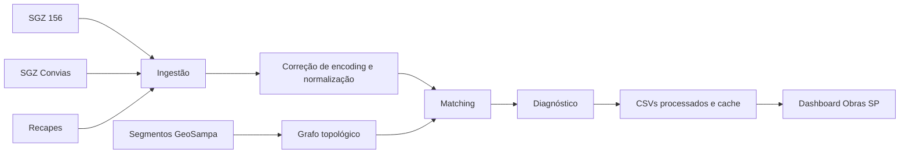

# Obras SP

Auditoria geoespacial de notificações e recapeamentos em São Paulo. O projeto transforma fontes operacionais fragmentadas em uma fila de investigação: cada notificação pode ser analisada contra um recape associado, sua confiança de match e as evidências técnicas de roteamento.

> Os dados ficam fora do versionamento. O repositório contém o pipeline e a interface; screenshots com informações operacionais não são publicados por privacidade.

## Visão geral

O dashboard Streamlit organiza a operação em seis áreas:

- Visão geral: cobertura, fluxo de matching, perdas no roteamento e regionais críticas.
- Auditoria: filtros, fila paginada, exportação e detalhe do caso.
- Mapa: notificações, recapes roteados e camadas semânticas.
- Pipeline: arquitetura, estado dos artefatos e etapas de engenharia.
- Qualidade dos dados: confiança, distância, falhas topológicas e exportação.
- Sobre o projeto: contexto técnico e limitações reais.

A interface usa exclusivamente o tema escuro, com tokens visuais centralizados e cores reservadas para semântica operacional.

## Problema

Notificações do SGZ 156 e Convias e informações de recapeamento chegam em bases independentes. O processo manual exige comparar endereços com grafias diferentes, localizar trechos, interpretar os limites `De`/`Até`, verificar o status de obra e consolidar o resultado sem uma trilha de evidências única.

## Solução

O ETL normaliza os dados, realiza o matching de notificações com recapes e roteia os trechos sobre os segmentos reais do GeoSampa. A interface não altera decisões do pipeline: ela expõe o resultado, sinaliza matches que exigem revisão e permite investigar cada caso sem fingir que há persistência multiusuário.



## Arquitetura

```text
obras-sp-pipeline/
├── dashboard/
│   ├── app.py
│   ├── components/       # cards, filtros, gráficos, mapa e detalhe do caso
│   ├── pages/            # visão geral, auditoria, mapa, pipeline, qualidade e case
│   ├── services/         # carregamento resiliente e métricas puras
│   ├── styles/           # tokens e CSS com seletores específicos
│   └── utils/            # formatação e códigos semânticos de status
├── src/
│   ├── transform.py      # ETL, matching, relatório de run e persistência
│   └── road_graph.py     # RoadGraph, STRtree, cache e roteamento
├── tests/
│   ├── test_normalization.py
│   ├── test_matching.py
│   ├── test_metrics.py
│   ├── test_failures.py
│   └── test_road_graph.py
├── data/
│   ├── raw/              # entradas locais, não versionadas
│   ├── processed/        # saídas do ETL, não versionadas
│   └── cache/            # GeoJSON e grafo persistente, não versionados
├── requirements.txt
└── README.md
```

## Fluxo do pipeline

1. Lê `sgz_156.csv`, `sgz_convias.csv` e `recape.xlsx` ou `recape.csv`.
2. Corrige texto com encoding corrompido quando identificável.
3. Normaliza CEP, data, coordenadas e nome de logradouro.
4. Obtém ou reutiliza `segmento_logradouro` do GeoSampa.
5. Constrói ou lê um grafo topológico persistente.
6. Roteia cada recape entre `De` e `Até`.
7. Cruza notificações e recapes.
8. Gera arquivos processados, relatório de cobertura, falhas detalhadas e o estado da execução atual.

O arquivo opcional `data/processed/pipeline_run.json` é sobrescrito a cada execução bem-sucedida. Ele descreve o estado atual, durações por etapa, contagens, cache e workers configurados; não simula um histórico de observabilidade inexistente.

## Roteamento GeoSampa

`src/road_graph.py` constrói um grafo por logradouro a partir de segmentos reais. As extremidades são nós; cada segmento é uma aresta com geometria e comprimento. Para cada recape, o processo:

- resolve a via por CODLOG, nome exato ou fallback fuzzy;
- encontra as interseções de `De` e `Até` com `STRtree`;
- valida se os nós pertencem ao mesmo componente conectado;
- avalia caminhos simples e escolhe o mais próximo da extensão esperada;
- concatena somente segmentos originais, sem gerar linhas aproximadas.

O cache em `data/cache/geosampa_road_graph.pkl` inclui assinatura do GeoJSON. Quando tamanho ou data de modificação do arquivo de origem mudam, o cache é invalidado.

## Estratégia de matching

O cruzamento atual usa uma cascata conservadora:

1. compara nomes normalizados com `RapidFuzz` (`token_sort_ratio`, limite 85);
2. desempata pelo mesmo CEP ou por distância de até 0,3 km;
3. aceita somente nome quando o score é pelo menos 90;
4. mantém `SEM_COBERTURA` quando não encontra evidência suficiente.

Os CSVs novos persistem códigos semânticos, como `CONCLUIDO`, `PLANEJADO`, `EM_ANDAMENTO` e `SEM_COBERTURA`. `REVISAO` é uma sinalização de interface para matches fracos, não uma alteração de regra de negócio do ETL. CSVs legados com emojis ainda são interpretados pelo dashboard.

## Diagnóstico de falhas

Nenhum recape sem geometria é descartado silenciosamente. O pipeline classifica, entre outras, as causas:

- `CODLOG_INEXISTENTE`
- `SEM_RUA` / `FUZZY_NAO_RESOLVEU`
- `SEM_INTERSECAO_DE`
- `SEM_INTERSECAO_ATE`
- `SEM_CAMINHO`
- `GEOMETRIA_INVALIDA`

As evidências ficam em `data/processed/recapes_sem_cobertura.csv`, com via, CODLOG, segmentos, interseções, componente, caminho e mensagem detalhada. O resumo agregado é salvo em `geosampa_coverage_report.json`.

## Stack

- Python, pandas e openpyxl
- GeoPandas, Shapely e pyproj
- NetworkX e STRtree
- RapidFuzz
- Streamlit, Plotly e Pydeck
- pytest

## Como executar

Pré-requisito: Python 3.11+ e ambiente virtual funcional.

```bash
python -m venv .venv
.venv\Scripts\activate
pip install -r requirements.txt
python src/transform.py
streamlit run dashboard/app.py
```

Em Windows, feche arquivos abertos dentro de `data/raw/` antes de executar o ETL.

## Testes

```bash
pytest -q
```

Os testes cobrem normalização, correção de encoding, matching, códigos de situação, métricas em DataFrame vazio, diagnóstico de falhas, rota por segmentos reais, componentes desconectados e invalidação de cache.

## Privacidade e LGPD

As fontes podem conter número de OS, endereço, coordenadas e informações operacionais. Por isso, `data/raw/`, `data/processed/` e `data/cache/` estão no `.gitignore`. Antes de qualquer publicação, revise os dados, anonimização, base legal e política de retenção. A página “Sobre o projeto” mascara identificadores e nomes de vias no caso técnico exibido.

## Limitações

- O resultado depende da qualidade e completude das fontes.
- Nomes divergentes, coordenadas ausentes e trechos mal preenchidos podem reduzir a cobertura.
- O dashboard Streamlit é local e não possui autenticação nem persistência multiusuário.
- CSVs são uma camada de armazenamento de demonstração, não um sistema transacional.
- O mapa mostra amostragem determinística para manter o navegador responsivo; métricas e tabelas usam o recorte completo.

## Roadmap

- PostgreSQL/PostGIS e API FastAPI
- dbt e orquestração
- autenticação e auditoria multiusuário
- histórico de execuções
- testes de regressão geoespacial e observabilidade centralizada

## Autor

Gabriel Bitencourt
