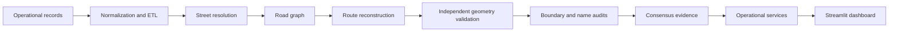

# GeoFusion

Operational geospatial reconstruction, audit and resurfacing intelligence platform.

GeoFusion resolves inconsistent street records, reconstructs resurfacing segments against São Paulo's road network, validates geometry through independent evidence, and exposes the result through an operational dashboard.

[](https://www.python.org/)
[](https://github.com/brielgaa/geofusion/actions/workflows/ci.yml)

> Public-release note: operational inputs, generated outputs, caches and review artifacts are intentionally excluded from the repository. See [the local data boundary](data/README.md) before running a public copy.

## What it does

GeoFusion is an evidence-driven operational system that:

- normalizes resurfacing and notification records;
- resolves streets using exact, alias, fuzzy, contextual and geographic evidence;
- reconstructs route segments over a road graph;
- keeps official geometry separate from shadow reconstruction;
- validates candidates through independent geometry evidence;
- audits boundary and street-name contradictions;
- preserves provenance, confidence and warnings;
- provides street, number, coordinate, record, surface and protection lookups.

The product is not presented as an AI project, a generic dashboard or an academic prototype. Its focus is geospatial engineering, data reconciliation, validation and operational auditability.

## Why this problem is hard

Operational records rarely describe a road segment in a single consistent language. They may contain abbreviated or misspelled names, missing or conflicting `De`/`Até` boundaries, incomplete geometry, different coordinate systems, disconnected road-network components, and source snapshots that disagree.

GeoFusion therefore treats matching as an evidence problem rather than a simple fuzzy-string search. A candidate can carry method, confidence, token coverage, geographic distance, topology status, boundary evidence, warnings and review requirements. Ambiguity remains visible instead of being silently promoted.

## Architecture



The official ETL remains separate from diagnostic, shadow and human-review outputs. The dashboard consumes the operational layer without promoting shadow evidence into the official resurfacing dataset.

## Geometry confidence model

| Tier | Meaning | Operational interpretation |
| --- | --- | --- |
| **Official** | Geometry is present in the official resurfacing source. | The source geometry is shown as official. |
| **Shadow · high / medium** | A reconstructed candidate has stronger diagnostic evidence. | Useful for investigation; never equivalent to official geometry. |
| **Estimated** | A candidate is available, but evidence is insufficient for a stronger tier. | Visible with uncertainty and provenance. |
| **Unresolved** | No usable geometry was promoted for the record. | The absence is preserved as a result. |

Shadow quality and Consensus are separate evidence streams. Consensus remains shadow-only in the current release: no official promotions were applied.

## Operational dashboard

The dashboard includes:

- **Home** — collection summary, geometry tiers, protection status and search entry point;
- **Consulta de Via** — street, number, coordinate or resurfacing-ID lookup with explicit alternatives;
- **Proteção de Recapes** — `ACTIVE`, `EXPIRING_SOON`, `EXPIRED` and `UNKNOWN_DATE` queues;
- **Mapa** — quality and protection layers with operational filters;
- **Auditoria** — official, reconstruction, validator, boundary/name and Consensus evidence;
- **Qualidade** — deterministic aggregates from the loaded artifacts;
- **Pipeline / Sobre** — technical flow, artifacts, limitations and product guardrails.

See [Operational Dashboard](docs/operational-dashboard.md) for the page-level contracts.

## Current results

The following values come from the current local operational artifacts and dashboard classification:

| Operational quality tier | Records | Share |
| --- | ---: | ---: |
| Official geometry | 1,577 | 31.4% |
| Shadow · high / medium | 445 | 8.9% |
| Estimated | 2,121 | 42.2% |
| Unresolved | 879 | 17.5% |
| **Total resurfacing records** | **5,022** | **100.0%** |

These tiers are mutually exclusive in the dashboard. `Official + shadow high/medium` is a stronger evidence grouping, not a claim of official coverage. Diagnostic reports use their own scope and must not be added to these counts without checking overlap.

Additional availability indicators:

- **Surface attribute availability:** 3,289 / 5,022 records, approximately 65.5%. This is not geometry coverage.
- **Street-number lookup support:** approximately 92.0% of 217,212 road segments have number ranges. This is lookup support, not address accuracy.
- **Protection:** status uses the explicit resurfacing completion date when available. Notification receipt dates are never substituted as execution dates.

## Consensus evidence

The current Consensus artifact is `SHADOW_ONLY` and records no official promotions:

| Consensus class | Records |
| --- | ---: |
| `CONSENSUS_HIGH` | 0 |
| `CONSENSUS_MEDIUM` | 20 |
| `CONFLICTING_EVIDENCE` | 1,877 |
| `INSUFFICIENT_EVIDENCE` | 2,514 |
| `REJECTED_BY_CONSENSUS` | 611 |

The Consensus layer is deliberately not conflated with the geometry-quality shadow layer. Read [Consensus Evidence](docs/consensus-evidence.md) for its evidence families and limitations.

## Performance

GeoFusion uses a persisted SQLite text index for the street lookup path. It contains 217,212 segments and is approximately 53.4 MB. Geometry WKB remains lazy for textual lookup; coordinate lookup keeps the separate spatial path.

| Metric | Before | After |
| --- | ---: | ---: |
| Cold street + number | ~20.01 s | ~2.20 ms |
| Process total for street + number | ~21.76 s | ~1.30 s |
| RSS after street + number | ~765.6 MB | ~114.3 MB |
| Semantic equivalence sample | — | 1,000 / 1,000 |

Coordinate lookup is intentionally not represented as a text-index speedup: the measured spatial path remains approximately 19 seconds because it initializes the heavier spatial resources.

See [Operational Performance](docs/operational-performance.md) for the benchmark, equivalence audit and deterministic index-build procedure.

## Tech stack

Python, Pandas, GeoPandas, Shapely, PyProj, NetworkX, RapidFuzz, SQLite, Streamlit, PyDeck and Pytest.

## Quick start

The repository is tested on Python 3.11+.

```powershell
python -m venv .venv
.\.venv\Scripts\Activate.ps1
python -m pip install -r requirements.txt
python -m pytest -q -m "not private_data"
```

The public command exercises tests that do not require private operational artifacts. With the complete local dataset available, run the full suite with `python -m pytest -q`.

To build the persisted text index when the required local source data is available:

```powershell
.\.venv\Scripts\python.exe -m src.operational.build_lookup_index --root . --benchmark
```

To open the dashboard:

```powershell
.\.venv\Scripts\streamlit.exe run dashboard/app.py
```

## Data requirements

Operational inputs are not shipped. A complete local run expects source files under `data/raw/` and generated artifacts under `data/processed/` and `data/cache/`. Those directories may contain addresses, coordinates, work-order identifiers, internal source extracts, downloaded images, checkpoints or human-review decisions.

Do not copy those directories into a public repository. A sanitized demo dataset is not included in v1.0; creating one is a future release task that requires explicit data-ownership review.

## Repository structure

```text
geofusion/
├── dashboard/          Streamlit operational product
├── src/                geospatial, audit and operational engines
│   ├── operational/    persisted lookup and operational services
│   └── image_geometry/ archived audit-only research
├── tests/              regression and semantic tests
├── docs/               architecture, operations and evidence notes
├── data/config/        tracked configuration
└── data/               local inputs and generated artifacts; not public
```

## Validation

- Public CI: 319 tests pass without private operational artifacts; 8 private-data tests are intentionally deselected.
- Full local validation: 375 tests pass with the complete local operational artifacts.
- Python modules compile successfully with `compileall`.
- The persisted index has a valid metadata contract and deterministic build artifacts.
- The lookup equivalence sample is 1,000 / 1,000 with zero mismatches.
- Protected-core hashes remain unchanged across the operational dashboard work.

Validation is evidence about the tested artifacts and scenarios. It is not a claim of 100% accuracy or universal production readiness.

## Limitations

- Official geometry currently covers 31.4% of resurfacing records; reconstructed tiers are not official geometry.
- Estimated geometry is not equivalent to independently validated geometry.
- Execution date is not universally available; notification receipt is not treated as execution.
- Coordinate lookups initialize heavier spatial resources than text lookups.
- Operational datasets may not be redistributable.
- An experimental image-geometry branch was evaluated through controlled feasibility studies and archived after failing the evidence threshold required for integration.

## Documentation

- [Architecture](docs/architecture.md)
- [Data flow](docs/data-flow.md)
- [Running](docs/running.md)
- [Operational dashboard](docs/operational-dashboard.md)
- [Operational performance](docs/operational-performance.md)
- [Consensus evidence](docs/consensus-evidence.md)
- [Consensus calibration](docs/consensus-calibration.md)
- [Geometry validation](docs/geometry-validation.md)
- [Boundary contradiction audit](docs/boundary-contradictions.md)
- [Boundary name recovery](docs/boundary-name-recovery.md)

## License

No software license is selected in this release candidate. Add a license only after ownership and publication authority have been confirmed.
