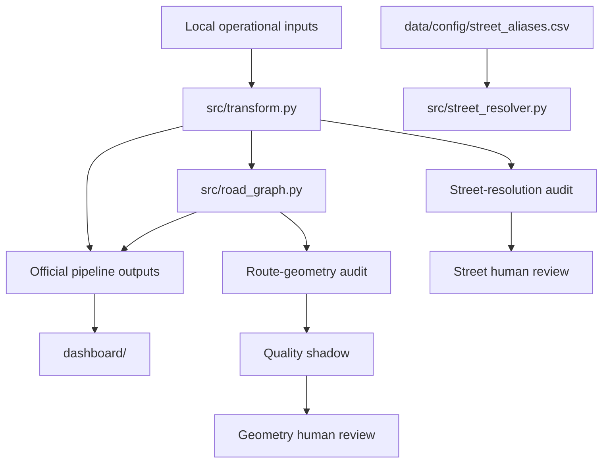

# Architecture

GeoFusion is currently a script-compatible Python application. The repository has multiple engines, but they share stable filesystem contracts under `data/processed/` and `data/cache/`.

## Components

| Component | Responsibility | Layer |
| --- | --- | --- |
| `src/transform.py` | Loads, normalizes, routes, matches, and persists the official ETL outputs. It also dispatches existing diagnostic commands. | Official entry point |
| `src/street_resolver.py` | Resolves street names and contextual transversals, with evidence, confidence, cache, and audit reporting. | Diagnostic engine |
| `src/road_graph.py` | Builds/loads the segment graph and exposes `RoadGraph.route()` for routing over source geometries. | Shared routing engine |
| `src/route_geometry_audit.py` | Evaluates records without official geometry and writes audit/shadow artifacts without applying geometry. | Diagnostic/shadow |
| `src/*review*.py` | Loads audit candidates, persists human decisions, and exports review reports. | Human review |
| `dashboard/` | Reads official processed artifacts and presents local investigation pages. | Presentation |
| `tests/` | Exercises normalization, matching, routing, audits, reviews, and dashboard metrics. | Validation |

## Data ownership boundaries

- The official layer owns the outputs consumed by the dashboard: normalized records, matches, coverage reports, and the current pipeline run.
- The diagnostic layer reads official inputs and writes independent audit files. It must not rewrite `recape_clean.csv` or alter `RoadGraph.route()`.
- The shadow layer explores alternative geometry or human-reviewed resolution without promoting it to official data.
- The human-review layer records decisions and exports. A review flag is evidence for a later controlled decision, not an automatic confirmation.

## Why the repository is not moved to `src/geofusion/`

The current scripts are imported directly by tests and by one another using both top-level and relative fallbacks. A physical package move would change import resolution and command paths across the ETL, audits, and review tools. This pass keeps those contracts stable and improves discoverability through documentation and explicit commands.
